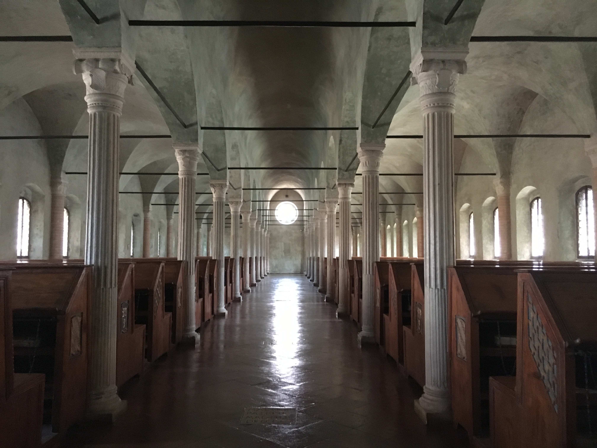

Questa esplorazione, questo viaggio nella parola scritta (ma non solo scritta, lo vedremo) parte da me, dai libri che ho amato in diverse epoche della mia vita e dalle ragioni per cui li ho amati, e si estende a cercare di afferrare la natura sfuggente della categoria, o forse meglio sovracategoria, della *narrazione del reale*.

Un contenitore con molti nomi (in ambito anglosassone "creative nonfiction", "literary nonfiction", "narrative nonfiction" o ancora "verfabula"; in Italia spesso "nonfiction" tout court) contenuti estremamente vari, pochi confini e poche certezze. Ma ai curiosi e agli eclettici può piacere anche così.

Leggevo di recente Paolo Cognetti, in un vecchio post del suo defunto blog, che si interrogava, un paio d'anni dopo l'uscita di *Gomorra* e dal punto di vista di un autore di narrativa, sulla natura di questa "nuova" narrativa del reale, senza riuscire ad afferrare cosa fosse esattamente, associandola ad altri fenomeni in crescita come i reality show o le docufiction e usando aggettivi a mio parere fuori fuoco, come "sinistro", "pericoloso", "disonesto".

Ecco, già che ci siamo, *Gomorra*. Nel lungo, estenuante dibattito nazionale seguito alla pubblicazione, del libro di Saviano si è detto tutto e il contrario di tutto; un saggio di Simone Del Latte ne descrive la genesi in casa editrice come l'idea di creare "un'opera che se la giocasse a cavallo tra fiction e non-fiction". Il risultato è un libro importante nella storia della nostra cultura (più per il suo valore civile che per quello artistico) ma immaturo dal punto di vista del giornalismo narrativo, complici probabilmente la giovane età dell'autore e la poca dimestichezza dell'editor che lo ha seguito con questo genere.

Ma torniamo a noi e cerchiamo di capire cosa comprende questo genere. Una definizione molto ampia potrebbe essere "un genere di scrittura che applica le tecniche della narrativa a fatti realmente accaduti, argomenti che potrebbero trovare spazio in un giornale o in un libro di testo scolastico". Quando dà il meglio di sé combina la raffinatezza tecnica di un romanzo ben costruito con la rigorosa verifica delle informazioni tipica del giornalismo.

Al suo interno trovano spazio molte cose diverse, provo a elencarle:

- **i memoir o autobiografie.** Un esempio per tutti: *L'anno del pensiero magico* di Joan Didion, per citare da subito una protagonista del new journalism americano.

- **le biografie.** Qui, fra i tanti esempi possibili, mi viene subito da sfoderare un altro asso: *Limonov* di Carrère.

- **il giornalismo narrativo.** C'è l'imbarazzo della scelta, faccio solo qualche nome: Gay Talese, Rodolfo Walsh, Philip Gourevitch, William Langewiesche, Lawrence Wright, Martín Caparrós.

- **il reportage d'autore,** quando in un ribaltamento di ruoli è lo scrittore a decidere di cimentarsi con il reale, come nel caso di David Foster Wallace che, su incarico della rivista Harper's, parte per una crociera ai Caraibi e ci regala *Una cosa divertente che non farò mai più*, oppure come nel nitido *Underground* di Haruki Murakami.

- **certe cronache di viaggio,** come *Ebano* di Kapuscinski.

- **saggi di giornalismo scientifico,** come per esempio i libri di Michael Pollan pubblicati da Adelphi.

- **opere "true crime",** fra cui non si può non citare *A sangue freddo* di Capote, capostipite del genere, oppure *Un estraneo al mio fianco*, l'incredibile libro di Ann Rule su Ted Bundy. Qui aggiungo volentieri un'opera italiana, recente e molto bella: *La città dei vivi* di Nicola Lagioia.

- **per chiudere la panoramica con una nota lievemente trasgressiva,** merita una menzione anche il gonzo journalism, il cui testo di culto è senza dubbio *Paura e disgusto a Las Vegas* di Hunter S. Thompson.

Mi rendo conto che è un panorama molto vasto, se si aggiunge poi che io amo molto anche il giornalismo investigativo (le cui imprese tuttavia, quando si trasformano in libri, sono spesso meno stilisticamente rifinite), i reportage lunghi, i podcast e i documentari, c'è l'imbarazzo della scelta.

Ebbene, quello che mi propongo è di guidarvi o, forse meglio, di farmi accompagnare in questa esplorazione, articolata in:

- una rassegna dei grandi classici del genere (nella sezione **[Vecchie Glorie](/biblioteca/vecchieglorie/)**)
- una raccolta di recensioni delle mie scoperte recenti (nella sezione **[Nuovi Arrivi](/biblioteca/nuoviarrivi/)**)
- qualche gustosa digressione su articoli, podcast o documentari particolarmente interessanti (nella sezione **[Fior da Fiore](/biblioteca/fiordafiore/)**)

Va da sé che ogni contributo alla riflessione o suggerimento di nuovi spunti di lettura sarà accolto con entusiasmo e gratitudine.

---

Chiudo in bellezza con una citazione da uno splendido saggio di Leila Guerriero sul "giornalismo narrativo, le sue origini e le sue ragioni", pubblicato originariamente su Revista Anfibia e tradotto e ospitato dal blog delle edizioni SUR, che vi consiglio caldamente di leggere:

> "Il giornalismo narrativo è un mestiere modesto, praticato da individui abbastanza umili da sapere che non potranno mai comprendere il mondo, abbastanza testardi da perseverare nei propri obiettivi, e abbastanza superbi da credere che questi obiettivi interessino a tutti."
