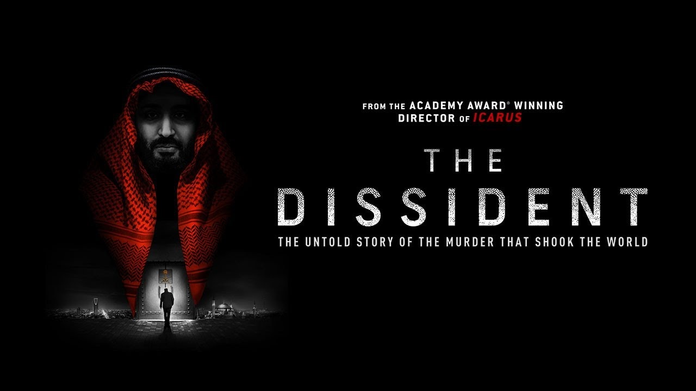

Oggi vi segnalo un'opera di stretta attualità che ha (purtroppo) richiami diretti alla cronaca internazionale degli ultimi giorni. 

Si tratta di [The Dissident](https://www.thedissident.com/), il documentario che ricostruisce la storia dell’omicidio, avvenuto nell’ottobre del 2018 presso il consolato dell’Arabia Saudita a Istanbul, del giornalista del Washington Post Jamal Khashoggi. Una storia talmente incredibile che si vorrebbe davvero credere che non sia vera, che non sia possibile commettere una simile atrocità e per di più farla franca.           

Il regista è Bryan Fogel, che con il suo precedente lavoro, un altro bellissimo documentario investigativo, intitolato Icarus e dedicato agli scandali del doping nel mondo dello sport ([lo trovate su Netflix](https://www.netflix.com/it/title/80168079)), nel 2018 si è aggiudicato il premio Oscar per il miglior documentario.

Questo suo nuovo lavoro, elegante nella forma e rigoroso nei contenuti, ricostruisce tutta la dinamica della pianificazione ed esecuzione dell’omicidio e del successivo occultamento del corpo. Fa un bellissimo racconto corale, costruito attraverso le testimonianze di  Iyad El Baghdadi (scrittore, attivista e dissidente arabo), Wadah Khanfar e Omar Abdulaziz (giovane attivista saudita amico di Khashoggi che il documentario segue come una specie di coprotagonista), di come le primavere arabe, e in particolare quella egiziana, hanno cambiato radicalmente Khashoggi, completando la sua trasformazione da giornalista integrato con il regime a dissidente, in particolare rispetto alla svolta autoritaria impressa al paese dal principe ereditario Mohammad Bin Salman Al Sa’ud (MBS per gli amici e forse soprattutto per i nemici). Il documentario mette ordine in tutte le notizie che si sono succedute e accavallate in questi anni e riannoda diversi fili solo in apparenza scollegati, come la storia della battaglia sui social fra le mosche e le api o lo scandalo della relazione extraconiugale di Jeff Bezos, l’uomo più ricco del mondo, il cui telefono [sarebbe stato hackerato](https://www.ilsole24ore.com/art/il-telefonino-bezos-hackerato-principe-saudita-bin-salman-ACyglWDB) tramite un messaggio inviato da MBS in persona.

Il richiamo di più stretta attualità alla vicenda risale alla settimana scorsa, quando il presidente americano Joe Biden ha consentito che fossero rese pubbliche le conclusioni del rapporto sull’omicidio, finora top-secret, dell'Ufficio del Direttore Nazionale dell'Intelligence americana. Nel documento si afferma che il principe ereditario saudita avrebbe approvato se non addirittura ordinato l’uccisione del giornalista. Come dice Wadah Khanfar (giornalista palestinese, ex direttore generale del network Al Jazeera) nel documentario:

“Doveva essere ucciso in modo da mandare un messaggio a tutti gli altri. Se uccidi una persona con lo status di Jamal chi altri non uccideresti? Puoi uccidere tutti.”

Le fasi più drammatiche dell’uccisione e del successivo occultamento del cadavere, così come sono state ricostruite dalle indagini, sono introdotte gradualmente attraverso le trascrizioni delle registrazioni audio fatte all’interno del consolato (che vengono risparmiate allo spettatore, con quella che mi sembra una scelta di dignità e di misericordiosa), inframmezzate alle varie linee narrative parallele che percorrono il documentario, e affidate nel momento più terribile e toccante ai silenzi di Agnès Callamard (relatrice speciale per le esecuzioni extragiudiziali, sommarie o arbitrarie per il Consiglio dei diritti umani delle Nazioni Unite) e di Irfan Fidan (il procuratore capo di Istanbul).

Segnalo una piccola perla di leggerezza: il frammento di fuorionda di una serissima intervista durante il quale [un gatto all’improvviso](https://www.youtube.com/watch?v=YvHs_dEIIo8) salta in braccio a Khashoggi, vestito di tutto punto, suscitando l’ilarità generale.

La prima mondiale del documentario al Sundance Film Festival lo scorso gennaio  è stata molto acclamata, poi però il film ha faticato a trovare un distributore e non è stato acquistato dalle grandi piattaforme di streaming (nemmeno da Netflix, che grazie a Icarus ha ottenuto il primo Oscar per un documentario), a quanto pare per non rischiare di alienarsi il pubblico saudita. Acquistato finalmente da un distributore indipendente, ha imboccato il canale on demand. Nel primo weekend di distribuzione, a gennaio, si è piazzato [al secondo posto](https://apnews.com/article/itunes-movies-top-10-movies-9b452af9ee5ad50a5f219dec583315bc) fra i film indipendenti più noleggiati sull’iTunes store.

Il  documentario è disponibile (in lingua originale con sottotitoli in italiano) su [MioCinema](https://www.miocinema.com/it/the-dissident), una piattaforma on demand a sostegno del cinema d’autore, collegata e complementare rispetto alle sale cinematografiche d’essai sul territorio, che offre, con il supporto tecnologico di MyMovies, film e documentari di qualità in prima visione, oltre a retrospettive, anteprime e contenuti originali esclusivi.