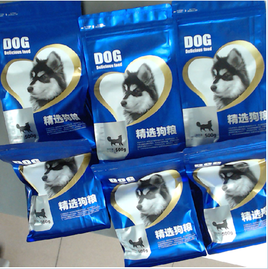

](https://missotter.wordpress.com/wp-content/uploads/2020/10/fentanyl.jpg)

[Ben Westhoff
[FENTANYL, INC.
[How Rogue Chemists Created the Deadliest Wave of the Opioid Epidemic
[New York, Atlantic Monthly Press, 2019](https://groveatlantic.com/book/fentanyl-inc/)

È uscita da pochi giorni negli USA l’edizione tascabile rivista e aggiornata del libro di Ben Westhoff, Fentanyl, Inc., la cui edizione hardcover risale allo scorso settembre.

Ben Westhoff è un giornalista investigativo pluripremiato che si è occupato di temi molto diversi, dalla scena gangsta-rap di Los Angeles alle dispute tribali dei nativi americani, fino alla corruzione in ambienti governativi. Scrive per Wall Street Journal, Rolling Stone, Guardian, Village Voice, Vice, Oxford American e altre testate.

Fentanyl, Inc. denuncia la crisi provocata dal fentanil e da altre droghe sintetiche negli Stati Uniti come “la più distruttiva nella storia americana: peggio del crack negli anni '80, peggio delle metanfetamine nel primo decennio degli anni 2000, peggio dell'eroina e degli analgesici negli anni ‘10”.

I problemi degli americani con gli oppioidi sono iniziati negli anni '90 con l’abuso di analgesici come l’OxyContin. Una volta diventati dipendenti da questi farmaci, molti pazienti sono passati all'eroina, perché aveva un effetto simile ma costava di meno ed era più facilmente reperibile, dal momento che per l’eroina non c’è bisogno di ricetta medica. Negli ultimi anni però si è diffusa un’alternativa più letale: il fentanil. Assomiglia all'eroina, ma è completamente sintetico ed è 50 volte più potente. Spiega Westhoff:

“A causa della sua incredibile potenza, è estremamente difficile dosarlo in maniera corretta. Bastano due milligrammi, una quantità appena visibile a occhio nudo e molto inferiore a quella di una dose di eroina, per morire. Trafficanti e spacciatori “tagliano” le altre droghe con il fentanil, all'insaputa dei clienti, per renderle più efficaci. Se la quantità di fentanil aggiunta è troppa, però, uccide quasi all'istante. Di conseguenza, molte vittime del fentanil ne sono ignare, pensano di aver assunto eroina, cocaina, metanfetamine o analgesici. E così come il fentanil sta rimpiazzando l'eroina, altre nuove sostanze psicoattive stanno sostituendo le droghe tradizionali: marijuana, cocaina, LSD ed ecstasy. Per questa ragione, i decessi per overdose sono, al momento della pubblicazione di questo libro, la prima causa di morte degli americani sotto i cinquantacinque anni. In Canada le cifre sono altrettanto astronomiche e le morti per fentanil stanno aumentando anche a Portorico, in Australia e in molti paesi europei. In Svezia nel 2015 il fentanil e i suoi analoghi hanno superato l’eroina, diventando le sostanze più letali.”

Fentanyl, Inc si articola in quattro parti: la prima passa in rassegna le varie sostanze e la loro storia, la seconda ne analizza le modalità di consumo, la terza è dedicata alle strutture di produzione e alle reti di spaccio e la quarta illustra i diversi approcci al problema adottati nel mondo, dai più drastici a quelli orientati al contenimento del danno.

Il lavoro di indagine di Westhoff ha comportato interviste con centosessanta persone, visite a siti e laboratori di produzione in tutto il mondo e la consultazione di centinaia di documenti. Per raccontare la storia delle nuove sostanze psicoattive ha incontrato persone dipendenti da fentanil e altre droghe, alcune delle quali vivono per strada in condizioni di indigenza, mentre altre sono in buona salute e svolgono lavori ben pagati. Ha frequentato degli psiconauti, persone in cerca di emozioni che sperimentano su di sé gli effetti di droghe che nessun altro ha mai provato. Ha studiato il modo in cui queste droghe vengono pubblicizzate e vendute, dalle aziende alle strade, fino ai motori di ricerca. Ha esplorato il dark web per capire le nuove direttrici dello spaccio, quelle in cui la droga si compra online in cambio di bitcoin e arriva a casa dell’acquirente via posta o corriere. Ha passato mesi a studiare ogni anello della catena di distribuzione, dal piccolo spacciatore al grosso trafficante, dai produttori agli stessi creatori delle sostanze. Ha parlato con politici, poliziotti, agenti della DEA e responsabili delle politiche antidroga internazionali, che vorrebbero chiudere in prigione i trafficanti per sempre, ma anche con consulenti, medici, attivisti ed esperti secondo cui queste sostanze dovrebbero essere legalizzate. Ha corrisposto con due famigerati trafficanti di LSD, ora in carcere, che avevano il loro quartier generale in un sito missilistico abbandonato in Kansas; la loro storia, raccontata nel libro e ambientata in una location surreale, è formidabile.

Westhoff è stato anche il primo giornalista a infiltrarsi, fingendo di essere un acquirente, in due aziende cinesi: un sofisticato laboratorio che distilla queste sostanze letali in quantità industriali e un call center pieno di giovani venditori sorridenti che dai loro cubicoli le vendono a spacciatori americani e cartelli messicani. La seconda di queste aziende non opera clandestinamente, fa tutto alla luce del sole, perché il governo cinese offre aiuti economici e sgravi fiscali alle aziende chimiche che producono e vendono queste sostanze, e ogni volta che la Cina ne mette fuori legge una, i produttori modificano leggermente la struttura chimica e creano una nuova droga perfettamente legale. Molti analoghi del fentanil e molti cannabinoidi sintetici sono stati creati in questo modo. Nonostante le autorità cinesi nell’aprile del 2019 abbiano dichiarato di voler mettere al bando tutti gli analoghi del fentanil, i loro sforzi per ora non hanno intaccato il traffico internazionale clandestino che ha origine nel paese. Cito ancora Westhoff:

Affrontare questo problema è molto complicato, perché è una questione che trascende la lotta alla droga. La questione è politica, perché riguarda lo scontro fra le due maggiori potenze mondiali. È economica, perché riguarda gli inganni perpetrati dai giganti farmaceutici ai danni dei cittadini. È scientifica, perché dimostra che la ricerca può essere distorta per fini tragici. È tecnologica, perché sfrutta le innovazioni più incredibili in tempo reale ed è commerciale, perché ha sviluppato dei modelli di marketing geniali.

Nell’agosto del 2019 Westhoff è stato chiamato a riferire sui risultati della sua indagine di fronte a una commissione del Senato americano che si occupa delle possibili implicazioni per la sicurezza nazionale dei legami commerciali fra gli Stati Uniti e la Cina. Il video della sua testimonianza in commissione [si può vedere qui](https://tinyurl.com/wcls8qv).

*            *            * 

Se volete vedere, sentire o leggere qualcosa riguardo a Fentanyl, Inc. e al suo autore, Ben Westhoff ha presentato il libro in [una puntata di *[Fresh Air*](https://tinyurl.com/whmw3rp), storica trasmissione della *[National Public Radio*](https://en.wikipedia.org/wiki/National_Public_Radio) americana che vanta quasi 5 milioni di ascoltatori, e in [una puntata del podcast *[Joe Rogan Experience*](https://tinyurl.com/ruuypa3)(il secondo podcast in assoluto per numero di download su dispositivi Apple nel 2017 e nel 2018). *The Atlantic* ha pubblicato [un estratto del libro](https://tinyurl.com/yyz6bt3l) lo scorso agosto, *[Vice*[ ha fatto lo stesso ](https://tinyurl.com/y6bubjox)in settembre e sempre in settembre il *Los Angeles Times* ha pubblicato [un editoriale di Westhoff ](https://tinyurl.com/t6ptmrk)sul fentanil.

È possibile leggere qualcosa anche in italiano: sul sito Vita.it è stata pubblicata lo scorso novembre [un’intervista](https://tinyurl.com/tz9ea68) all’autore e l’estratto del libro uscito su Vice è stato tradotto e pubblicato anche [sul sito italiano](https://tinyurl.com/u8rkuet).

*            *            * 

Lo scorso giugno Ben Westhoff ha iniziato a produrre e distribuire la newsletter “Drugs + Hip-Hop”, che alterna longform monografici sui protagonisti della storia dell’hip hop ad approfondimenti sul tema della sua inchiesta ([ci si può iscrivere a questa pagina](https://benwesthoff.substack.com)). Ho ottenuto da lui il permesso di pubblicare la traduzione di due numeri della newsletter che contengono alcune sue conversazioni via skype con le impiegate dell’ufficio vendite della Yuancheng, l’azienda cinese che commercializza il fentanil e che Ben ha visitato fingendosi un acquirente. Le fotografie che accompagnano i testi sono state scattate da lui durante la visita.

**Domande a una venditrice di fentanil** **- 1**

(Fonte: https://benwesthoff.substack.com/p/ask-a-fentanyl-saleswoman)

](https://missotter.wordpress.com/wp-content/uploads/2020/10/image.png)Il reparto vendite della Yuancheng

Per capire meglio il commercio delle nuove sostanze psicoattive, nel 2017 mi sono messo in contatto con diversi produttori e distributori cinesi. Non è stato difficile, le informazioni di contatto si trovano sui loro siti. Mi sono concentrato su quelli che vendono i precursori del fentanil, gli ingredienti indispensabili per la sua produzione. I cartelli messicani ne comprano grandi quantità e poi producono in casa il fentanil che vendono negli Stati Uniti. Partendo dai precursori, il processo è molto semplice.

Ho scoperto che la sola Yuancheng, un’azienda con sede a Wuhan, vende più precursori di tutti gli altri commercianti del mondo. Tutto è iniziato con questa conversazione con un’addetta alle vendite, che chiamerò Mindy. Sulle prime ho finto di essere un potenziale acquirente, poi le ho rivelato la mia identità. La nostra conversazione mi ha aiutato a capire come l’azienda gestisce questi commerci e come i suoi dipendenti giustificano moralmente il proprio lavoro.

***3 ottobre 2017***

Mindy: Ciao. Scusa, ieri sera non ero collegata. Quanto NPP ti serve?

Io: *Vendi sia NPP che 4-ANPP?*

Sì. L’NPP è al 99.4%. Sono cristalli giallognoli. Questi sono i prezzi: 1kg: 520 dollari. 4-ANPP è al 99.46%, in polvere giallo chiaro. 1kg: 2570 dollari. Che quantità ti servono?

*Lavori nel reparto vendite della Yuancheng a Wuhan?*

Sì, ma l’anno scorso mi hanno trasferita nella filiale di [nome della filiale]. L’azienda ha diverse sedi qui in Cina.

*La tua azienda produce la maggior parte dell’NPP e del 4-ANPP esportato dalla Cina?*

No, non lo produciamo noi, lo vendiamo soltanto. Non abbiamo una fabbrica. Però vendiamo la maggior parte dell’NPP e del 4-ANPP.

*Quante persone lavorano nel reparto vendite?*

Più di 400. Posso sapere quanto NPP o 4-ANPP ti serve? E come hai conosciuto la Yuancheng?

*Scusami, ho ancora qualche domanda.*

Certo. Chiedimi pure quello che vuoi.

*Da quali paesi proviene la maggior parte dei vostri ordini?*

I principali acquirenti di NPP e 4-ANPP sono gli Stati Uniti e il Messico.

*I pacchetti contenenti NPP e 4-ANPP che spedite sono anonimi?*

Sì.

*Come fate con gli ordini più grossi, per esempio da 10 chili?*

Per spedire 10 chili facciamo 3 pacchetti. Confezioni alimentari. Non è sicuro fare una spedizione da 10 chili.

*Puoi farmi vedere la foto di una confezione?*

Sì, un momento.

Cambiamo spesso confezioni, non usiamo sempre le stesse.

*Ah, molto utile, grazie. Cosa succede se in dogana li aprono? Potrei avere dei problemi?*

No, non avrai nessun problema, tracciamo noi le spedizioni una volta partite. Se ci sono problemi con la dogana, ti avvisiamo di non contattare il corriere, così gli agenti doganali non possono risalire a te. Non verranno mai a casa tua. Però se non ti senti sicuro puoi darmi un nome falso e anche scegliere un indirizzo diverso da casa tua a cui possiamo spedire.

*Ok. Il vostro NPP è accompagnato da un certificato di purezza?*

Sì. Te lo mando domani, ok? Adesso sto andando a casa, non sono più in ufficio.

*D’accordo.*

C’è qualcos’altro che desideri sapere?

*Vorrei sapere qualcosa di te, visto che sei tanto gentile. Cosa hai studiato all’università?*

Inglese. Volevo fare l’insegnante.

*Ah, molto interessante! Perché non hai fatto l’insegnante?*

Ora penso che il mestiere di venditrice sia più adatto a me. Mio padre pensa che insegnare sia molto faticoso. E insegnare per tutta la vita anche noioso.

*A tuo padre piace il tuo lavoro attuale?*

Sì, è stato lui a suggerirmi di fare questo lavoro.

*Ti piace il tuo lavoro? Ti pagano bene?*

Sì, guadagno di più di un’insegnante. Però è più faticoso, non abbiamo molte vacanze, lavoriamo più di 8 ore al giorno, per sei giorni alla settimana.

*Sei mai stata nel laboratorio?*

Sì, ma solo una volta.

*Com’è? Molto moderno?*

Sì, ci sono molti prodotti. L’NPP è un prodotto delicato. A cosa ti serve? So che lo comprano in tanti ma non so a cosa serve.

*Ah no? Si usa per produrre il fentanil. Sai che cos’è?*

Sì, so cos’è il fentanil. Ma a cosa serve? Noi qui in Cina non lo usiamo.

*È come un’eroina sintetica. Sta creando grossi problemi di dipendenza e molti morti qui negli Stati Uniti. La peggiore crisi di droga della storia.*

Sì, so che fa male alle persone. Però io devo venderlo e a volte mi sento in colpa. L’NPP non è vietato in Cina, quindi possiamo venderlo. Io lo vendo perché ho bisogno di soldi, devo guadagnarmi da vivere.

*Forse dovresti fare l’insegnante!*

Fra qualche anno lo farò.

*Conosci qualcuno che vende il fentanil lì?*

No, qui la vendita è vietata, non so chi lo vende. Io vendo solo prodotti la cui vendita è legale. [emoji sorridente]

*La tua azienda ha paura delle autorità o è tranquilla perché l’NPP è legale?*

L’NPP può essere prodotto e venduto all’estero. Non è permesso venderlo in Cona. Quindi non è del tutto legale. Forse a metà strada fra legale e illegale. È un prodotto delicato.

*Il tuo capo vi parla mai di questo?*

No. Non ne parla mai.

*Come sai che è a metà strada fra legale e illegale?*

Non sono una bambina. Lo so. [emoji sorridente]

*Come si chiama il tuo capo?*

Yip Chuen Fat. [*Nota: è la trascrizione del nome di Ye Chuan Fa in uso a Hong Kong.*]

*È gentile?*

Sì.

*L’hai incontrato di persona?*

Sì, quando lavoravo nella sede di Wuhan lo vedevo tutti i giorni.

*È giovane o vecchio?*

Vecchio. Ha più di 60 anni.

*È molto ricco?*

Sì, dicono che negli anni ’90 fosse l’uomo più ricco di Wuhan.

*Interessante.*

Scusami, è ora di cena.

*Ok, non c’è problema! Grazie per aver parlato con me!*

Grazie a te. Mi hai fatto compagnia in treno. Ora sono arrivata a casa.

*Ok, bene. Ci sentiamo domani, o comunque molto presto!*

Ok, domani ti mando il certificato di autenticità. Buona giornata.

*Grazie!*

***4 ottobre 2017***

Mindy: ecco il certificato di autenticità.

](https://missotter.wordpress.com/wp-content/uploads/2020/10/image-3.png)

***17 ottobre 2017***

Mindy: Ciao.

Io: *Buongiorno. Credo che da te sia sera!*

Sì, sto tornando a casa.

*È stata una buona giornata al lavoro?*

Sì, molto impegnativa.

*Ho qualche domanda da farti sulla tua azienda, se posso.*

Ok.

*Yuancheng fa solo vendite, non è un laboratorio di produzione, giusto?*

Hanno un magazzino nel quale testano i prodotti.

*Come si chiama il laboratorio che produce l’NPP e il 4-ANPP che vendete?*

Questo non lo so.

*Dove si trova il magazzino? Nello stesso edificio in cui lavori tu?*

Ci sono due magazzini, uno a Wuhan e l’altro a Shenzhen, vicino a Hong Kong.

*Quando lavoravi a Wuhan sei stata nel magazzino?*

Sì.

*Com’è? Grande? Ci lavorano molti chimici?*

Non ci sono chimici, ci sono i tecnici che testano i prodotti. È grande. 

*Mi hanno detto che a Wuhan i dipendenti dell’azienda vivono in un grande condominio. Lo conosci?*

No.

*Quando lavoravi a Wuhan l’azienda ti forniva l’alloggio?*

Sì, c’era un dormitorio per i dipendenti.

*Quante persone ci vivevano?*

6-7 persone per ogni stanza. Ma non so quante erano le stanze.

*Quante persone vivevano con te nella tua stanza?*

Questa domanda non ha a che fare con il lavoro.

*Ok, capisco. Scusa se ti ho offesa.*

Non mi hai offesa.  

*Scusa, cerco solo di ottenere delle informazioni. Non voglio farti perdere tempo.*

Non mi sembra che tu sia un cliente normale.

*Non sono un cliente. Sono uno scrittore, sto scrivendo un libro su queste sostanze.*

Quindi scriverai nel tuo libro le cose che ti ho detto? Mi sento presa in giro.

*Mi dispiace. Sono molto curioso di sapere come funziona il loro commercio, perché stanno facendo molti danni negli Stati Uniti. E ti sono molto grato per il tuo aiuto.*

COME FAI A CONOSCERE YUANCHENG?

*Da Internet. Non voglio metterti nei guai. Cerco solo delle informazioni.*

Ok.

*Mi hai detto che a volte ti senti in colpa a fare questo lavoro. Forse se continui ad aiutarmi ti sentirai meno in colpa.*

[Nessuna risposta.]

*Ci sei ancora?*

***Post-scriptum: ***Dopo questa conversazione Mindy non ha più risposto ai miei messaggi. Non so se lavora ancora alla Yuancheng.

*            *            *

**Domande a una venditrice di fentanil – 2**

(Fonte: https://benwesthoff.substack.com/p/ask-a-fentanyl-saleswoman-part-ii)

La Yuancheng non è un’azienda clandestina gestita da un cartello di trafficanti. Opera alla luce del sole e riceve sussidi ed encomi dal governo cinese. I dipendenti sono giovani laureati che parlano un buon inglese. Nei primi mesi del 2018 sono andato in Cina e sono riuscito a entrare nell’azienda, le foto di questo post vengono da là, molte sono inedite. Prima del mio viaggio ho parlato via Skype con diversi dipendenti dell’azienda, fra cui una venditrice cordiale che chiamerò Kelly. Assunta da poco, oberata di lavoro e sottopagata, Kelly faticava a generare un buon volume di vendite.

Diversamente da Mindy — che mi ha confessato di avere degli scrupoli a fare quel lavoro — Kelly non sa e non si preoccupa di quello che fanno i clienti con i precursori del fentanil che gli vende.

](https://missotter.wordpress.com/wp-content/uploads/2020/10/image-4.png)Il reparto vendite della Yuancheng

***11 ottobre 2017***

Io: *Ciao, ci sei?*

Kelly: Sì.

*Ottimo. Piacere di conoscerti. Vendi l’NPP e il 4-ANPP?*

Sì, li vendo.

*Posso farti qualche domanda?*

Dimmi pure.

*In quali paesi spedite la maggior parte degli ordini?*

Inghilterra, America.

*E in Messico?*

Spesso anche lì.

*Cos’hai studiato all’università?*

Servizi per il trasporto aereo.

*Wow! E come sei finita a fare questo lavoro?*

È una lunga storia.

*Ti pagano bene?*

Così così.

*Quanti anni hai?*

23.

*Ti preoccupa il fatto che qualcuno possa usare queste sostanze per produrre droghe pericolose?*

La maggior parte dei miei clienti non mi dice perché le acquista.

*Ma la cosa ti preoccupa?*

No, non mi preoccupa.

*Ti piace il tuo lavoro?*

Non è male. Bisogna lavorare.

*A gennaio verrò a Wuhan. Sono uno scrittore, sto scrivendo un libro su queste sostanze. Questo è il mio sito: [http://benwesthoff.com/](https://email.mg1.substack.com/c/eJxNj0uOwyAQRE9jlhZgCPaCxWxyDYtPO2EGA4L2RL794GQzUkstVX_qlTMIj1xPXXJDcjSoa_B6UTe1SEW8poo7ZUlo61YBdhOiJuWwMTiDIadrWQg2T-SpPadMCiao5X5btkneQFoO1CxKmlkxclms5vABkgOdUzzXYoInUT8RyzB9Dfzey0J6QcNn3rbR5b0rJGhOOe0slDGp6DSysb6-BZVlc4Og-4ON7bANjfu5TkjVJkKCX-jDxwX9Vjv32vt-pIDnCsnYCF5jPYDgJ_-bEM8COsGrRUCE-hF7TsVnsdxIN_K5_0z6H-gf_GtvLg)*

Ok.

*Quando vengo, saresti disponibile a parlare con me del tuo lavoro? Avrò con me un interprete che ci potrà aiutare. *

Sì. Mi fa piacere aiutarti.

***12 ottobre 2017***

*Come fate a spedire la merce negli Stati Uniti? Se per esempio dovessi ordinare un chilo, come funziona?*

Inviamo pacchi anonimi da un chilo via DHL, in genere arrivano nel giro di cinque giorni.

](https://missotter.wordpress.com/wp-content/uploads/2020/10/image-7.png)Pubblicità della Yuancheng all’interno della sede dell’azienda

***16 ottobre 2017***

*Buonasera, come va?*

Buonasera. Sto facendo gli straordinari.

*Te li pagano?*

No.

*Ti capita spesso di lavorare oltre l’orario normale?*

Sì, perché io sono nuova qui.

*Quante ore alla settimana lavori di solito?*

54.

*E quanto ti pagano?*

Adesso ho un salario molto basso.

*Lavori sei giorni alla settimana?*

Sì.

*Puoi permetterti un appartamento in affitto?*

Per il momento no. L’azienda fornisce vitto e alloggio.

*Quante delle persone che lavorano con te sono alloggiate dall’azienda?*

Circa la metà.

*Hai una stanza tutta per te o la condividi?*

Non ho una stanza solo per me.

](https://missotter.wordpress.com/wp-content/uploads/2020/10/image-8.png)L’albergo di Wuhan dove vivono i dipendenti della Yuancheng

*Quante persone dormono nella tua stanza?*

Ci sono stanze da 4 persone e stanze da 6-7 persone.

*Sono tante!*

Nelle aziende cinesi è normale.

*E i pasti li mangiate in mensa?*

Sì.

*Il cibo è buono?*

Così così.

*Che cosa vi danno da mangiare?* Cucina cinese. Per ogni pasto ci sono due portate e una zuppa. In genere riso, pollo e verdure.

](https://missotter.wordpress.com/wp-content/uploads/2020/10/image-9.png)Il cuoco della mensa della Yuancheng prepara la cena

***17 ottobre 2017***

*Come va oggi?*

Bene. Sto mangiando della frutta.

*Buona. Che frutta mangi?*

Una mela.

*Anche io sto mangiando una mela!*

E adesso un pompelmo.

*Un pompelmo? Ne mangi tanta, di frutta. Che musica ti piace?*

Allegra o jazz.

*Allegra? Boy band, cose del genere? Ti piace Justin Bieber?*

Preferisco Taylor Swift.

*Ah, è una delle mie preferite.*

Per esempio Shake it off.

*Bella. A me piacciono anche Bad Blood, Blank Space e I Knew You Were Trouble When You Walked In.*

***18 ottobre 2017***

*Ciao. Come stai?*

Bene. E tu?

*Molto bene. Come va la vita?*

Molto monotona.

*Non sembri contenta. Cosa c’è che non va?*

Faccio tutti i giorni le stesse cose.

*Mi dispiace.*

Ma parlare con te è divertente.

*Grazie. Anche io mi diverto! Hai fatto molte vendite?*

No, non ho molti clienti per ora.

*Prendi commissioni sulle vendite?*

Sì.

*Mi dispiace non essere un tuo cliente.*

Non c’è problema, siamo amici.

*Qual è la tua emoji preferita?*

:D

*Bella! Come fai a procurarti dei clienti? Ci lavori tutti i giorni?*

Sì, devo lavorarci tutti i giorni. Ma questo lavoro mi piace, quindi non è poi così male.

*Hai ragione.*

Tu non hai un orario di lavoro, vero?

*È vero, io sono uno scrittore, posso lavorare quando voglio. Hai fatto amicizia con i tuoi compagni di stanza? Uscite insieme, vi divertite?*

Spesso andiamo fuori a cena, o al cinema. Il dormitorio non è un bel posto.

*Cos’ha che non va il dormitorio?*

Il quartiere non è granché. E poi affaccia sulla strada. È un po’ rumoroso.

*Che film andate a vedere? Anche film americani?*

Sì, di recente abbiamo visto Spider-Man: Homecoming.

*Cos’altro ti piace fare per divertirti?*

Mi piace andare al cinema, giocare a biliardo e viaggiare. Sono stata in diversi posti in Corea, Thailandia e in Cina. E tu?

*A me piacciono la musica e il baseball, e mi piace stare con i miei figli.*

Quanti anni hanno?

*Uno tre e l’altro cinque. Sono due maschi.*

Ti va di farmi vedere le loro fotografie?

*In questo momento sul telefono non ne ho.*

È ora di uscire, sono ancora in ufficio. Quando esco vado a fare un giro in bicicletta con un’amica.

](https://missotter.wordpress.com/wp-content/uploads/2020/10/image-10.png)Foto da un evento aziendale, forse un karaoke. Le scritte in alto dicono “innovazione” “laboriosità” “onestà” e “soddisfazione reciproca”.

***19 ottobre 2017***

*Hai fatto delle vendite oggi?*

No.

*Il tuo capo si chiama Ye Chuan Fa?*

Sì.

*Lo vedi tutti i giorni?*

Sì.

*Ti piace?*

Sì, mi piace, perché lui è il capo. Ma presto andrò via da Wuhan.

*Perché?*

Vado a lavorare nella filiale di [nome della filiale].

*Wow. E quando?*

La prossima settimana.

*Hai deciso tu o ti ci manda l’azienda?*

Mi mandano loro, non posso decidere io.

](https://missotter.wordpress.com/wp-content/uploads/2020/10/image-12.png)Il CEO della Yuancheng, Ye Chuan Fa, con due addette alle vendite. Entrambe si chiamano Amy e si parla di loro in Fentanyl, Inc.

*Il tuo capo è un uomo molto ricco?*

[nessuna risposta]

*Ho sentito dire che è molto ricco. E che fuma delle sigarette molto costose! Le Yellow Crane Tower 1916S.*

Wow, come fai a saperlo?

L'ho letto qui: http://www.zbjob.cn/Html/moban/679820754374.html

Oh. È una persona molto semplice.

*È discreto? Non guida macchine costose?*

Lui ha un autista. Ma perché ti interessa il mio capo?

*Per lavoro. Sto scrivendo un libro sull’industria chimica cinese. Per quello faccio tante domande.*

Forse non sono in grado di aiutarti.

*Mi hai già aiutato moltissimo! Ti ringrazio molto per aver parlato con me.*

Anche io ti ringrazio per aver parlato con me.

*Quando vuoi. Parli un ottimo inglese.*

No, il mio inglese non è buono ma chiacchierare con te mi fa stare bene.

***23 ottobre 2017***

*Cosa hai fatto nel weekend?*

Shopping. Ma solo domenica.

*Bello. Hai comprato qualcosa?*

Io no, ma la mia amica ha comprato delle scarpe.

***12 dicembre 2017***

*Sei nella nuova filiale?*

Sì. 

*Che bello. È un ufficio piccolo?*

Sì, in questo ufficio siamo in 12.

*Ti piace?*

Molto, il cuoco cucina benissimo.

*Evviva! Stai facendo un po’ di vendite?*

Sì, ma ne parliamo più tardi. Ora devo mettermi a lavorare.