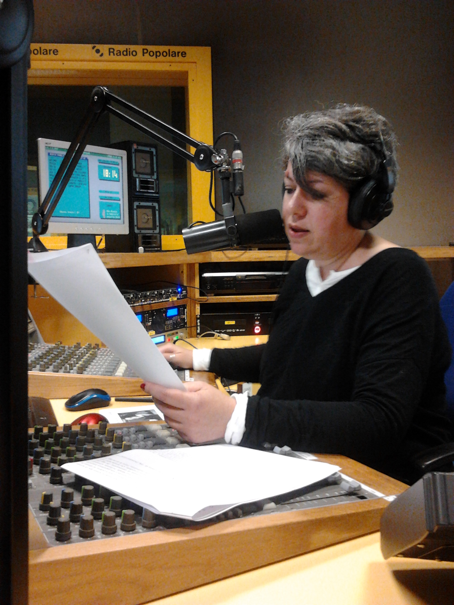

Ebbene sì, cari ascoltatori e followi che amate l’Alaska quanto me, invidiatemi pure, perché ho avuto l’onore e il privilegio di un’esperienza unica, e ve la voglio raccontare.

Lunedì, in occasione della seconda puntata autunnale di Alaska – queste nuove succulente puntate extralarge che Marina ci cucina una volta alla settimana – sono stata alla radio, silenzioso e attento testimone del processo che dà forma a quel che poi sentiamo tutti diffondersi nell’etere, o nei podcast.

Arrivata per tempo ed effettuato con destrezza un parcheggio di favore (sì, è un modo elegante per non dire che mi è andata sonoramente di culo) sono stata introdotta nell’antro della fattucchiera, dove mi è stato subito intimato: a) di sedermi, b) di tacere. Non male come inizio!

L’antro in questione è un sobrio localino finestrato inserito all’interno della redazione. Un tavolo ovale, quattro sedie, delle librerie, una stampante, una bellissima foto aerea di piazza Tahrir e poi lei con tutto il suo armamentario: borsa, computer, l’inseparabile iPhone e… tanta carta! Qui sopra la potete vedere, unghie rossissime e pennarello nero, intenta a redigere una specie di scaletta della puntata, con gli orari, gli argomenti e - credo - i contributi audio da inserire (era super concentrata, mica potevo mettermi a chiedere “cos’è quello?” o “a cosa serve?”).

Io zitta zitta, seduta di fronte a lei, ho osservato l’ultima mezz’ora di preparazione prima della messa in onda. La stampa dei testi necessari e la verifica che ci fossero tutti, poi un meticoloso processo di ordinamento cronologico dei testi: divisi in quattro blocchi, a scandire le mezz’ore di trasmissione, segnati tutti in testa a pennarello con l’argomento cui appartengono, in fondo a ogni blocco ci sono quelli che “se c’è tempo ne parliamo altrimenti saltano”, e a separare i blocchi l’uno dall’altro un post-it rosa sul quale di nuovo è scritto l’argomento. Il passaggio successivo consiste in un'altra verifica: la presenza di tutti i file audio necessari, siano essi brani musicali o pezzi di interviste o altri contributi simili da mandare in onda durante la trasmissione. Finite le verifiche, quando ormai manca una manciata di minuti, si arriva a un momento cruciale: la sigaretta prima di andare in onda! Un momento sacro e inviolabile, del quale, da debita distanza, sono riuscita a procurarmi un evocativo reperto.

Rientrata, la nostra raccoglie tutto il necessario (mi raccomando: l’acqua, che due ore sono tante!) e si avvia verso lo studio, ben consapevole che con tutto quello che ha in mano non riuscirà ad aprire la porta. Una volta dentro, prepara, sistema, smista tutto il necessario, con un occhio attento al monitor che scandisce i tempi. L’immagine successiva cattura un altro momento cruciale: la profonda concentrazione nei 60 secondi che precedono l’andata in onda. Chissà quale rosarietto privato stava recitando…

Ecco, ora che siamo dentro forse noterete che davanti a Marina, oltre al microfono, ci sono un paio di mixer. Ebbene sì, quel che non ti aspetti è che la regia della trasmissione non la fa un fonico dall’altra parte di un vetro, ma la fa lei mentre fa tutto il resto! Cosa significa? Significa che, oltre a quel che vi racconterò fra poco, con la mano destra alza e abbassa il volume della musica di sottofondo (nella foto sopra la mano è già sul cursore), con la sinistra apre e chiude il suo microfono (nella foto sopra, il primo cursore a destra del mixer più vicino), davanti a se guarda tre monitor, e con un mouse controlla un computer con cui manda in onda i brani audio che ha preparato prima. Sugli altri due schermi controlla la posta e fa ricerche su Google. (A me gira già un po’ la testa…)

Ma ora viene il bello. Ovvero la risposta alla domanda: quanto di quello che Marina dice durante la trasmissione è scritto sui fogli che ha con sé? Così come lo dice, praticamente niente!

Perché? Perché – e ci ho messo un po’ a capirlo – la traccia scritta della puntata sta sì e no in due paginette e mezzo, che corrispondono in buona sostanza a quello che poi si vede nel post sul blog, e che le forniscono l’attacco per aprire ogni blocco (ogni paragrafo, una volta letto, viene scrupolosamente barrato con il pennarello). Il resto dei testi che ha con sé… è in inglese, e lei li prende sì in mano uno a uno quando è il momento di parlarne ma poi semplicemente li riassume, oppure ne traduce delle parti all’impronta, scegliendoli mentre ne parla. (E qui è vertigine!)

Eccola mentre ci traduce al volo un testo.

Ancora più sorprendente è quel che succede quando, come è stato in questa puntata per Alexa O’Brien e Molly Crabapple, Marina manda in onda un audio nel quale parlano le persone citate. Direte: avrà sottomano una trascrizione, se la sarà tradotta e avrà con sé la traduzione. Eh no. Niente di niente!!! Cioè, per intendersi: lei fa partire l’audio, ne ascolta un brano cercando di ricordarsi di cosa sta parlando quella persona in quel momento, e poi attacca a parlarle sopra riassumendo a grandi linee il succo del discorso. Naturalmente, quando finisce di parlare e riprende ad ascoltare, non ha idea di dove sia arrivato l’audio nel frattempo, quindi deve ogni volta ritrovare il filo in pochi secondi. (E qui subentra il vero sbigottimento!)

Un paio di note di colore a completare l’ameno quadretto: fra un argomento e l’altro Marina inserisce uno stacco presentando dei brani musicali, che ascolta in cuffia a un volume tale che io, a un metro e mezzo di distanza, li sentivo perfettamente (non male, il nuovo singolo dei Pearl Jam!). Non paga, ogni tanto se non era troppo concentrata si rivolgeva a me facendomi una domanda gentile, come “tutto bene?” o “ti stai annoiando?” salvo poi, a causa delle cuffie, non sentire la risposta!

In questo reperto fotografico è immortalata mentre ascolta i Pearl Jam, in mano ha la traccia di cui vi ho appena parlato, su cui spicca il post-it rosa dell’argomento appena trattato (c’è scritto “TWTR”).

Dulcis in fundo, come non citare l’immancabile compagno di mille avventure? L’iPhone: giace in disparte costretto al silenzio, ma vibra rumorosissimamente annunciando l’arrivo di tweet/menzioni/stelline e quant’altro – e sì, durante la trasmissione un tweet o un retweet qua e là prima o poi ci scappano! – oppure, perché no, di una telefonata. Durante quelle due ore ne sono arrivate almeno due. E Marina che fa? Ride!

In conclusione, l’esperienza è stata divertente e interessante, ma ero tanto concentrata a capire come la fattucchiera riuscisse a tenere insieme da sola tutti gli elementi che compongono la trasmissione… che, per sapere di cosa ha parlato durante la puntata, lunedì sera mi sono dovuta riascoltare i podcast!

Firmato: il minipubblico.