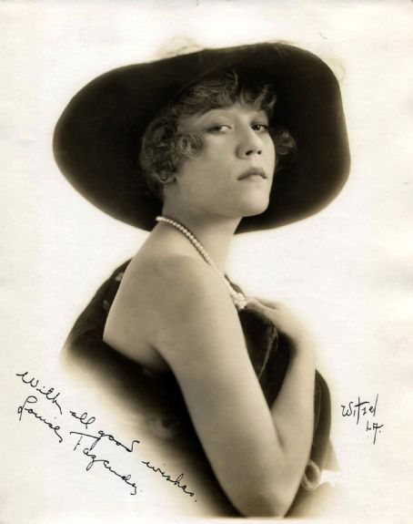

Che cos’hanno in comune il più giovane detenuto nella storia del carcere di San Quintino, un ricchissimo magnate dell’editoria americana del secolo scorso e una delle pietre miliari della storia del cinema americano, se non addirittura mondiale?

Un castello e una piscina.

È una lunga storia che mi è tornata in mente ascoltando [un podcast](http://www.deejay.it/audio/eddie-bunker/252747/%20) di *Dee Giallo,* la trasmissione condotta da Carlo Lucarelli su Radio DeeJay. Il racconto è affascinante e il finale, in cui Lucarelli ricorda il suo incontro con Edward Bunker al Festivaletteratura di Mantova, commovente. Mi ha ricordato un libro di Bunker che ho letto diversi anni fa: la sua autobiografia, *Education of a Felon: A Memoir*, pubblicato in Italia da Einaudi con il titolo *[Educazione di una canaglia*](http://www.einaudi.it/libri/libro/edward-bunker/educazione-di-una-canaglia/978880619143).

caption id="attachment_212" align="aligncenter" width="660"]  

 Edward Bunker nel ruolo di Mr. Blue, una delle iene di Tarantino. Un cameo autoironico.[/caption]

Per metà della sua vita Bunker è stato uno sbandato, un delinquente di piccolo calibro, dentro e fuori di continuo dalle prigioni californiane, nella seconda metà lo troviamo trasformato in scrittore, sceneggiatore e attore. La metamorfosi avviene attraverso uno spazio di transizione, il carcere, in cui Bunker trascorrerà, sommando i vari periodi di detenzione, ben diciotto anni della sua vita. Anni durante i quali non smetterà mai di leggere, di studiare e - da un certo momento in poi - di scrivere.  Il punto di svolta è la pubblicazione, nel 1973, del suo primo romanzo, di cui Dustin Hoffman comprerà i diritti per fare un film, *Vigilato speciale*. Non sarà l'unico dei suoi libri a essere portato sul grande schermo, e due anni dopo Bunker uscirà per l'ennesima volta di galera, per non tornarci mai più.

Ci fu nella vita di Bunker un incontro fortunato con una donna speciale: Louise Fazenda, moglie di Harold Brent Wallis, produttore per la Warner Bros di film del calibro di *Casablanca*. Lei, star del cinema muto onorata con una stella sulla Walk of fame, una volta ritiratasi dalle scene si dedicò al collezionismo di opere d’arte e alla filantropia. Bunker le fu presentato dall'avvocato Al Matthews durante un periodo di libertà sulla parola e Mrs. Wallis lo prese con sé per un po', affidandogli prima il ruolo di factotum e poi anche quello di autista. Fu sempre lei, quando Bunker venne di nuovo spedito in galera, a regalargli una macchina da scrivere, incoraggiandolo a coltivare il suo talento.

caption id="attachment_211" align="aligncenter" width="454"]  

 Louise Fazenza[/caption]

C’è un passo nella biografia di Edward Bunker che non ho mai dimenticato, è la descrizione di un luogo favoloso. Bunker accompagna Mrs. Wallis all’Hearst Castle di San Simeon, la sontuosa residenza che [Wiliam Randolph Hearst](http://it.wikipedia.org/wiki/William_Randolph_Hearst) fece costruire negli anni '20 su un’altura prospiciente la costa della California centrale.

caption id="attachment_210" align="aligncenter" width="660"]  

 Veduta aerea dell'Hearst Castle[/caption]

Louise Wallis era molto amica di Marion Davies, l’amante di Hearst, anche lei fulgida stella del cinema muto, e proprio in virtù di questa amicizia aveva accesso al castello di Hearst anche in assenza del padrone di casa.

caption id="attachment_220" align="aligncenter" width="434"]  

 William Randolph Hearst con Marion Davies[/caption]

Bunker e Mrs Wallis trascorrono qualche ora a San Simeon e lui descrive così un bagno solitario nella Neptune pool, la strabiliante piscina scoperta del castello (non che quella coperta fosse da meno).
Barefoot and shirtless and carrying a towel, I went outside. It was magic hour, that time when dusk smooths all the world’s wrinkles and blemishes. Everything seemed hushed and there was a feeling of enchantment. Gone were the weighted heat and the squinting glare. The softer light brought forth the luster of the marble. There was an evening breeze just beginning; roses, red and yellow, danced in it. Jasmine was already making perfume in the air. Ever since that day the scent of Jasmine has called up my memory of San Simeon.

The steps to the Neptune Pool were two strides wide, so I descended slowly. Fountains of intricate beauty fell in stages to the pool. Decades later, in Rome, I remembered the fountains of San Simeon when I saw those of Bernini. All were marble, as was the pool itself.

I stopped in unabashed awe. It was truly an enchanted moment in an enchanted place. Across from the fountains where I descended were pillars holding up an arch with a statue of Neptune. The hillside beyond fell away to the distant sea, into which the giant orange-red sun was inexorably sliding. Its rays came through the pillars and bathed the world in a golden hue. It was so wondrous that I ached with inchoate longing as I looked at it. I turned to face Casa Grande above and behind me. The twin spires were superimposed against faintly pink clouds moving slowly across the sky. The rich reliefs and detailing blended into the towers.

The breeze moved the water, and the geometric designs at the bottom shimmered ever so slightly. I paused on the pool edge. Into memory came my moment with William Randolph Hearst, old and gaunt, sick near death. If he had done nothing else, this alone was a monument that would last as far into the future as I could imagine.

I plunged into the water. The cold shock changed my thoughts. I swam hard to warm up, finally floating on my back, which gave me a better view of Casa Grande. What Mrs. Wallis had once told me was true: this had been Mount Olympus for the twentieth century versions of gods and goddesses, the stars of the movie screen. She told me that Chaplin had loved this pool and that Greta Garbo and John Gilbert had made love in it. George Bernard Shaw had done a lap or two; Winston Churchill had floated here.

Through Neptune’s fluted pillars came orange twilight glare. I swam through molten gold toward the sunset fire. I was certainly in a world removed from the swarm.
Oltre alle parole e ai ricordi di Bunker, un'evocazione molto suggestiva di quel luogo leggendario sta nella scena di apertura di *Citizen Kane* ([Quarto potere](http://it.wikipedia.org/wiki/Quarto_potere)), magistrale opera prima di Orson Welles, da lui diretta e interpretata nientemeno che nel ruolo del protagonista. Il film racconta la vita di Charles Foster Kane, magnate della stampa, la cui figura è inequivocabilmente ispirata a quella di Hearst. L'analogia è talmente smaccata che lo stesso Hearst fece di tutto per boicottarne le proiezioni, arrivò persino ad offrire alla RKO una montagna di soldi perché ne distruggesse pellicola e negativi.

embed]https://www.youtube.com/watch?v=-r0b_XeRkG4[/embed]  

In meno di due minuti e senza bisogno di parole Welles ci trasmette tutta l’essenza e l’eccentricità di un luogo leggendario e chiacchierato. La sequenza vede apparire in successione, avvolti da un crepuscolo nebbioso: un cartello con la scritta “NO TRESPASSING” appeso a una recinzione, una poderosa cancellata con il monogramma “K” in evidenza, una gabbia con due scimmie e un cartello su cui si indovina la scritta “BENGAL TIGER”, un laghetto con un piccolo pontile e due gondole ormeggiate, la sedicesima buca di un campo da golf e infine persino un ponte levatoio con tanto di catene. E in ciascuna di queste inquadrature compare, a volte sullo sfondo, a volte riflesso nell’acqua, un castello imponente con un’unica finestra illuminata.

caption id="attachment_215" align="aligncenter" width="660"]  

 Il castello di Charles Foster Kane in Quarto Potere di Orson Welles[/caption]

In una sequenza successiva, non meno famosa, il cinegiornale *News on the March* annuncia la morte di Kane e ne descrive la dimora con grande enfasi e dovizia di particolari, paragonandola a Xanadu, il leggendario castello di Kublai Khan che Marco Polo nel Milione ricordava così:
(...) una cittade ch’è chiamata Giandu, la quale fee fare lo Grande Kane che regna, Coblai Kane. E àe fatto fare in questa città uno palagio di marmo e d’altre ricche pietre; le sale e le camere sono tutte dorate e è molto bellissimo marivigliosamente. E atorno a questo palagio è uno muro ch’è grande 15 miglia, e quivi àe fiumi e fontane e prati assai. E quivi tiene lo Grande Kane di molte fatte bestie, cioè cerbi, dani e cavriuoli, per dare mangiare a’ gerfalchi e a’ falconi ch’egli tiene in muda: in quello lugo egli v’à bene 200 gerfalchi. Egli medesimo vuole andare bene una volta ogne settimana (a vedere). E piú volte quando ’l Grande Kane vae per questo prato murato, porta uno leopardo in sulla groppa del cavallo; e quando egli vuole fare pigliare alcuna di queste bestie, lascia andare lo leopardo, e ’l leopardo la piglia e falla dare agli suoi gerfalchi ch’egli tiene in muda; e questo fae per suo diletto.
E così Samuel Taylor Coleridge nel suo [Kubla Khan](http://www.poetryfoundation.org/poem/173247), i cui primi due versi sono citati all’inizio del cinegiornale.
In Xanadu did Kubla Khan
A stately pleasure-dome decree:
Where Alph, the sacred river, ran
Through caverns measureless to man
Down to a sunless sea.
So twice five miles of fertile ground
With walls and towers were girdled round;
And there were gardens bright with sinuous rills,
Where blossomed many an incense-bearing tree;
And here were forests ancient as the hills,
Enfolding sunny spots of greenery. (...)
Il cinegiornale conclude la descrizione del castello definendolo *the costliest monument a man has built to himself*, da far impallidire persino le più imponenti piramidi d’Egitto.

Fra queste due sequenze è incastonata quella - celeberrima - della morte di Kane: solo, nella sua stanza in cima alla torre più alta del castello di Xanadu. La mano ormai priva di vita lascia cadere a terra una palla di vetro di quelle con la neve dentro e le labbra esangui pronunciano la sua ultima parola, *Rosebud*, che sarà il filo conduttore di tutto il film.

Hearst, quello vero, però non è morto come Welles fa morire Kane. Non è nemmeno morto a San Simeon, ma in un'altrettanto magnifica villa di Beverly Hills in cui si era trasferito in seguito al progressivo aggravarsi della malattia. E nelle stesse ore in cui il vecchio miliardario prendeva congedo dalla vita, a mollo nella piscina del Nettuno a godersi lo spettacolo magnifico del sole che tramonta nell'Oceano Pacifico c’era proprio lui, il miserabile ladruncolo: Edward Bunker.

______

Breve nota di chiusura: per chi è curioso e riesce a non farsi distrarre troppo dalle scenografie, diversi ambienti dell’Hearst Castle fanno da sfondo al [video di G.U.Y.](https://www.youtube.com/watch?v=PNu_-deVemE) di Lady Gaga. Per chi fosse ancora più curioso, [il castello è visitabile](http://hearstcastle.org/).