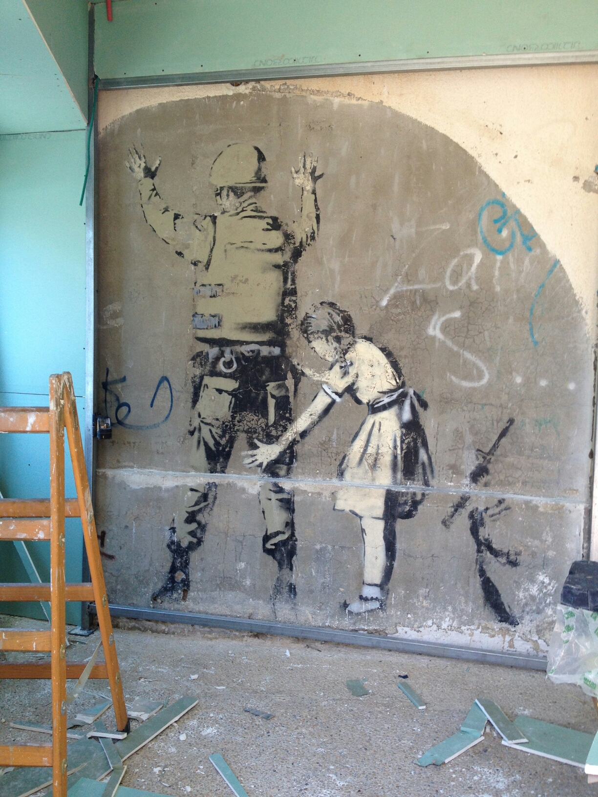
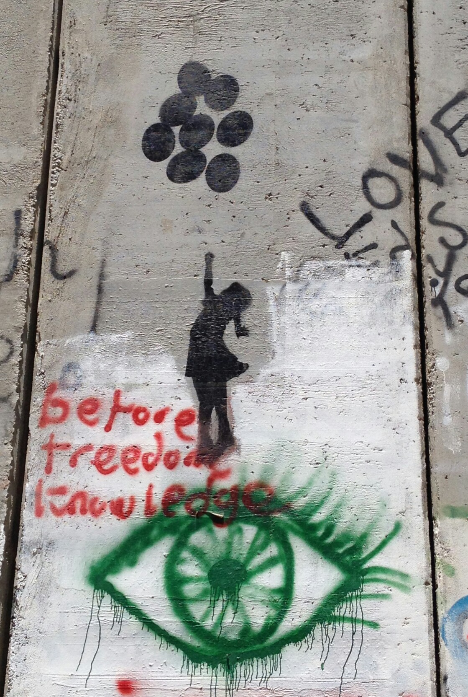

Oggi, complici l'arietta fresca e il pomeriggio libero, dopo la scuola ho deciso di andarmene un po' in giro per Betlemme a fare del turismo alternativo. Ormai con Betlemme ci ho preso la mano, le persone sono gentilissime e per la maggior parte si fanno i cazzi loro e ti lasciano in pace, salvo darti una mano volentieri se chiedi. Fanno eccezione i tassisti "abusivi" e le guide turistiche improvvisate ma quello è normale, sono lì apposta per acchiappare turisti smarriti e comunque si trova sempre il modo di far due chiacchiere in maniera civile. Dunque dicevo che mi sono concessa un po' di tempo per andare a caccia di murales. Banksy, ovviamente! Sono partita dalle istruzioni che ho trovato su [questa pagina](http://www.thewholeworldisaplayground.com/banksy-bethlehem-street-art/), e sono partita male, cercavo l'angelo ma non avevo preso bene nota dell'indicazione del posto, quindi nisba. Vagando senza meta mi sono imbattuta nell'[ufficio turistico palestinese](http://www.visitpalestine.ps) e ho provato a chiedere lì.

Un giovanotto gentile ha preso una cartina di Betlemme e ha segnato i punti in cui avrei potuto trovare i murales più facilmente raggiungibili (pare che non ne restino molti). Poi mi ha fatto vedere gli stessi punti su google maps ed è apparso presto chiaro che non aveva messo i segni nei posti giusti. Però almeno mi aveva dato qualche indizio, e il consiglio prezioso di prendere un taxi dalla fermata lì sotto e farmi portare un po' in zona, altrimenti ci avrei messo un'ora ad arrivarci a piedi. Nota: il territorio in zona è tutto collinoso per cui le passeggiate col sole a picco sono un po' pesanti. Salgo a bordo di un magnifico taxi collettivo*, lurido ma con le perline sul soffitto, che per l'esorbitante cifra di 3 shekel mi porta a destinazione (i taxi da turisti per meno di 20 shekel non fanno un metro). 

 Scendo, dopo una breve ma piacevole conversazione con uno dei passeggeri ("meno male che sai l'inglese, così puoi studiare l'arabo qui da noi, ma è comunque una lingua difficile, quindi auguri!") e trovo uno dei murales. 

 Rispetto alle foto del sito che mi ha fatto da guida c'è una novità, testimoniata dalla scala di legno in primo piano: gli stanno costruendo attorno una casetta! 

 Chissà se poi faranno pagare per vederlo, o se è a puro scopo conservativo?

Nella [foto del sito-guida](http://www.thewholeworldisaplayground.com/wp-content/uploads/2014/08/Banksy-Bethlehem-10.jpg), che risale alla scorsa estate, si vede che avevano messo una lampada a illuminarlo, e che la parete che adesso lo chiude è la stessa che prima gli stava accanto. Che si stiano facendo un box per la macchina?

Incoraggiata da questo primo successo mi guardo intorno alla ricerca di altro ma non trovo punti di riferimento. Allora mi infilo in [questo posto](http://www.alaslah.org) (una bella casa accogliente, peraltro) e chiedo al ragazzo alla reception se ha due minuti da perdere per farmi vedere dove trovo gli altri, se ce n'è. Lui gentilmente ha lasciato il suo posto e mi ha accompagnata a vedere questo. 

 Dopodiché tutti mi avevano detto di cercarne altri seguendo il muro. L'ho fatto ma senza successo, ce ne dovrebbe essere almeno un altro vicino al checkpoint di Gilo ma non l'ho trovato. C'era questo, ma si sa che è una patacca. 

 Ad ogni modo, camminando lungo il muro ho trovato un po' di altre cose interessanti. 

 Aggiungo una piccola nota di "resistenza botanica": alla faccia degli israeliani, alla base del muro crescono e fioriscono i capperi. Tié! 

 Buoni propositi: non demordo, vorrei ancora vedere l'angelo e soprattutto il lanciatore di fiori. Dovrebbero essere tutti e due a Beit Sahour. Sono rimasta d'accordo col giovane dell'ufficio turistico per una visita guidata all'[Herodion](http://it.m.wikipedia.org/wiki/Herodion), cercherò di convincerlo a fermarsi lungo la strada per cercarli.

* parentesi fantozzi: io mica lo sapevo che era un taxi collettivo! Arrivo alla fermata, ci sono tre taxi in fila, vedo tre persone salire sul primo quindi a logica mi dirigo verso il secondo, concordo in qualche modo destinazione e prezzo con il tassista e mi accomodo. Il taxi davanti però non parte, noi nemmeno e dentro fa un caldo micidiale. Chiedo perché non andiamo e il tassista mi dice "three persons". Ne so quanto prima ma spiego al gentile tassista che se devo aspettare lo faccio fuori dal mezzo perché dentro si muore. Poi, troppo poi, mi si accende la lampadina: il taxi davanti aspettava l'arrivo di un quarto passeggero, che avrei potuto essere io se appunto avessi capito il meccanismo al volo e il significato di quel "three persons"!

_______________________

Aggiornamento

Oggi sono tornata sul luogo del delitto e ho completato la raccolta di figurine! Con questo, che per me è un tantino kitsch. 

Questo, che mi hanno venduto per buono ma non ne sono sicura, trovo poche conferme in rete.

Ma soprattutto questo, che mi piace davvero tanto.

Non è stato semplice trovarlo perché è su un muro poco visibile dalla strada e perché per arrivarci bisogna passare dentro... un autolavaggio!

E a questo punto posso anche confermare che tutte le indicazioni e le mappe dell'utilissima [pagina che ho usato come traccia](http://www.thewholeworldisaplayground.com/banksy-bethlehem-street-art/) sono precise e accurate.