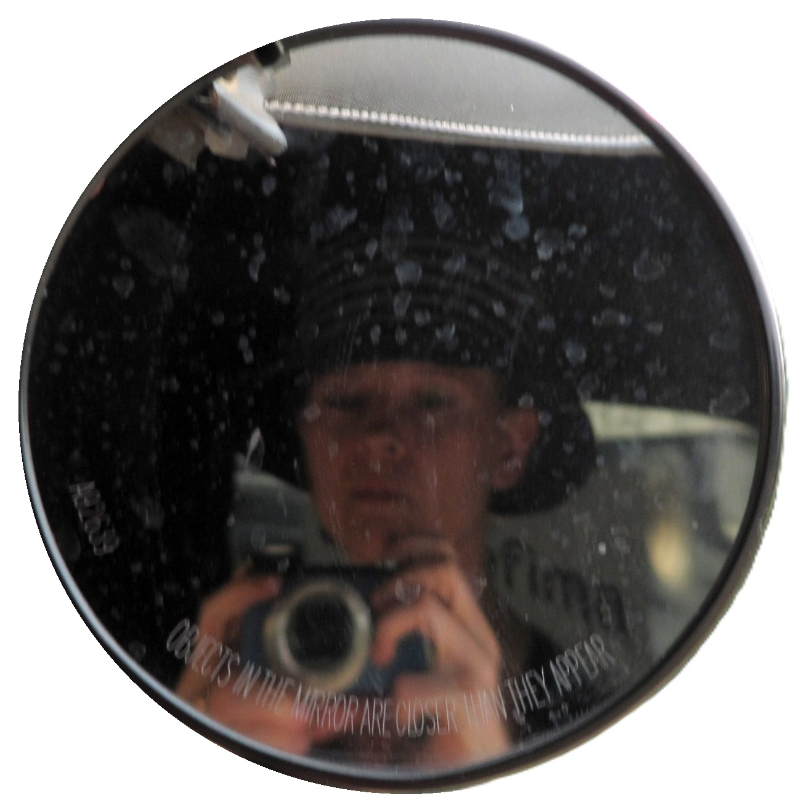

My name is Alessandra Neve. I'm a translator working with three languages: English, French and Spanish.

I mostly translate articles for newspapers and magazines, and essays or non-fiction books for publishers. I also consistently pursue scouting work, proposing journalistic texts to Italian publishers that I believe are worth bringing to Italian readers.

I believe the infinite variety of the world around us effortlessly surpasses — for better and, unfortunately, for worse — any fantasy or feat of imagination. I never stop marveling and feeling joy when a book, an article, a podcast or a documentary reveals the inquisitive gaze of an author who, with dedication — sometimes years of work — has committed to understanding, interpreting and explaining some aspect of this remarkable world we live in.

"Miss Otter" is a playful pseudonym that was born alongside the blog several years ago, in honor of an animal I'm very fond of: the otter.

Posts are open to comments, but if you'd like to write to me privately — to recommend an interesting text, documentary or podcast, to discuss something, or perhaps to entrust me with a translation — there's an email address at your disposal: missotter (at) outlook (dot) com

I'm also (was?) moderately active on Twitter, where my handle is @laleneve.

[One page of this website](/traduzioni) lists the books I have translated and includes links to some of my translations published online. If you'd like to get a sense of how I translate, you're welcome to take a look.

