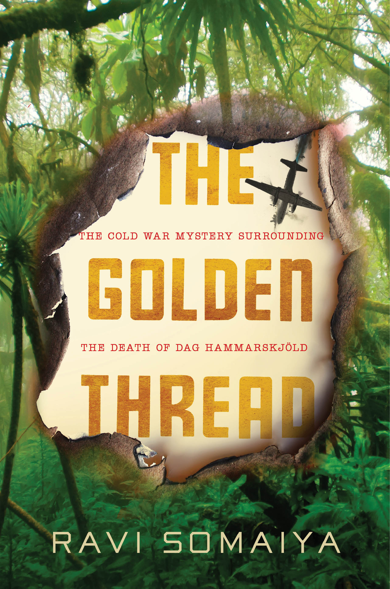
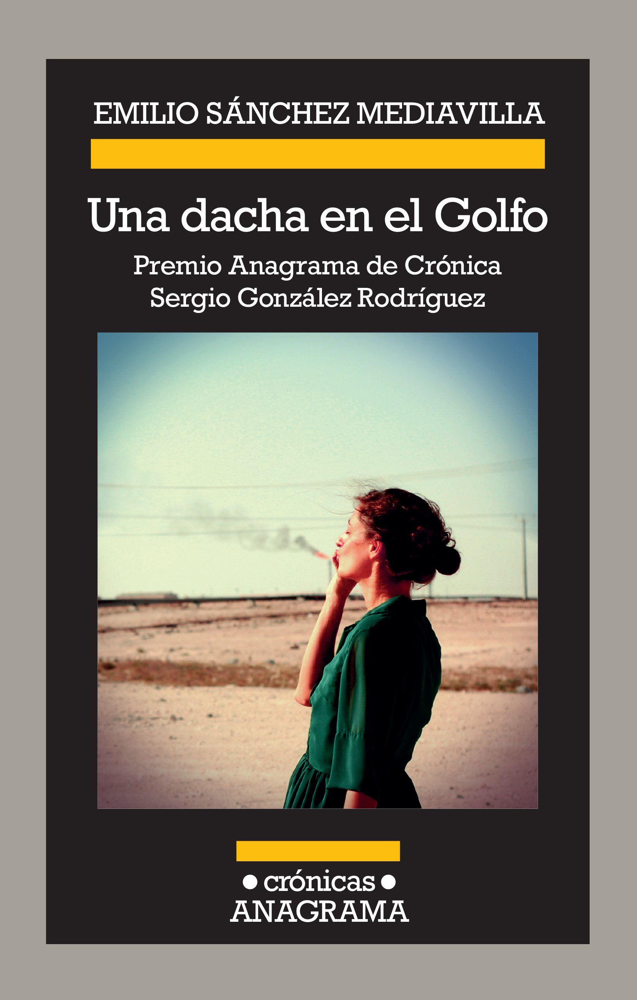
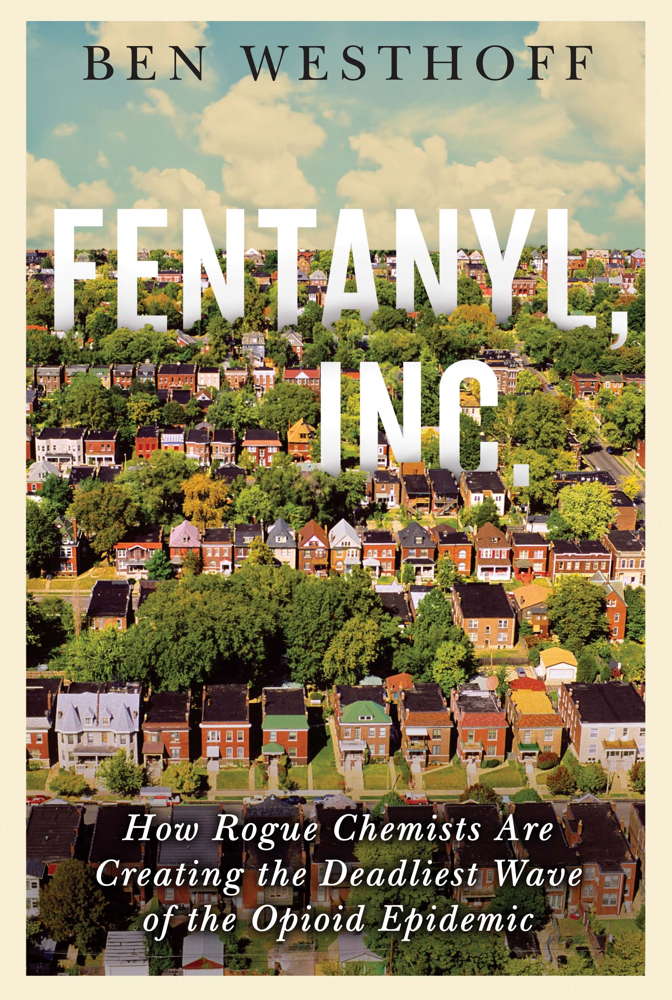

Questa pagina raccoglie le mie più recenti proposte editoriali, clicca sulle copertine per visualizzarle e scaricarle. Se desideri prendere visione di altri materiali o valutare un saggio di traduzione, scrivimi all'indirizzo ale (.) neve [at] gmail (.) com.

---

Óscar Martínez, cronista salvadoregno, prende a pretesto una storia dolorosa per riflettere sul suo mestiere di giornalista in un contesto di estrema violenza civile.

---

Matthieu Aikins, giornalista e reporter di guerra, racconta il suo viaggio lungo una delle rotte della migrazione, da Kabul ad Atene, insieme a un gruppo di rifugiati afghani.

---

Un libro affascinante ripercorre, sullo sfondo del Congo dei primi anni '60, la storia di un cold case illustre: la morte del segretario delle Nazioni Unite Dag Hammarskjold.

---

Diciannove giornaliste arabe raccontano che cosa significa fare informazione sul campo nei loro paesi, spesso in contesti di guerra.

---

Una giovane giornalista britannica ci guida in un viaggio avventuroso per più di 5.000 chilometri lungo le ferrovie del Myanmar e attraverso la storia del paese.

---

Un giornalista spagnolo che ha vissuto per due anni in Bahrein descrive con sguardo attento e a tratti ironico le mille contraddizioni del piccolo paese del Golfo.

---

Eliot Higgins, fondatore di Bellingcat, il celebre collettivo internazionale di ricercatori OSINT, investigatori e citizen journalist, ne racconta passato, presente e prospettive future.

---

Un'indagine approfondita sul mercato mondiale delle droghe sintetiche a partire dalla crisi degli oppioidi negli Stati Uniti.
