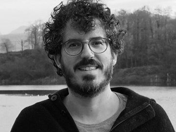

Prosegue la mia collaborazione con il progetto di blog collettivo *Assaggi* di nonfiction.it. I testi che seleziono per il progetto sono spesso articoli, racconti o estratti delle opere recensite in questo spazio, i cui autori mi hanno gentilmente concesso di tradurre e pubblicare un loro scritto inedito in Italia. Per chi volesse farsi un'idea di come traduco, *Assaggi* è il posto giusto.

  
  

    <h3>Darren Byler</h3>
    
<a href="https://nonfiction.it/assaggi/la-storia-di-vera/">La storia di Vera</a>

    
Una studentessa dell'Università di Washington, originaria dello Xinjiang, invischiata nelle maglie della sorveglianza cinese.

  

  
  

    <h3>Ravi Somaiya</h3>
    
<a href="https://nonfiction.it/assaggi/il-complotto-africano/">Il complotto africano</a>

    
Sono stati i bianchi europei, guidati da un fantomatico "mister X", a uccidere sessant'anni fa in Congo il segretario generale delle Nazioni Unite per mantenere il potere sui neri africani?

  

  
  

    <h3>Emilio Sánchez Mediavilla</h3>
    
<a href="https://nonfiction.it/assaggi/beirut-non-esiste-piu/">Beirut non esiste più</a>

    
Una passeggiata per le strade e fra la gente di Beirut nella primavera del 2016, per assaggiare, osservare e ascoltare le molte contraddizioni di una città complessa e tormentata.

  

  
  

    <h3>Zahra Hankir</h3>
    
<a href="https://nonfiction.it/assaggi/il-re-del-ful/">Il re del Ful</a>

    
Lo stufato di fave è il protagonista indiscusso di questo viaggio nella gastronomia, nelle tradizioni e nella storia del Libano meridionale.

  

  
  

    <h3>Rebecca Altman</h3>
    
<a href="https://nonfiction.it/assaggi/sul-vinile/">Sul vinile</a>

    
Un saggio storico sulla produzione della plastica per capire le ragioni del disastro ferroviario di East Palestine e sensibilizzare sui rischi per la salute umana e ambientale.

  

  
  

    <h3>Clare Hammond</h3>
    
<a href="https://nonfiction.it/assaggi/lungo-i-binari-delle-ferrovie-fantasma/">Lungo i binari delle ferrovie fantasma</a>

    
Un estratto da "On the Shadow Tracks", il viaggio-inchiesta di Clare Hammond lungo le ferrovie birmane.

  

