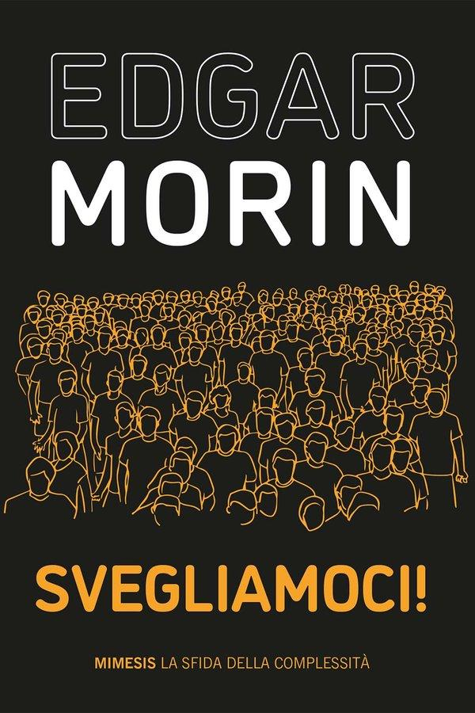
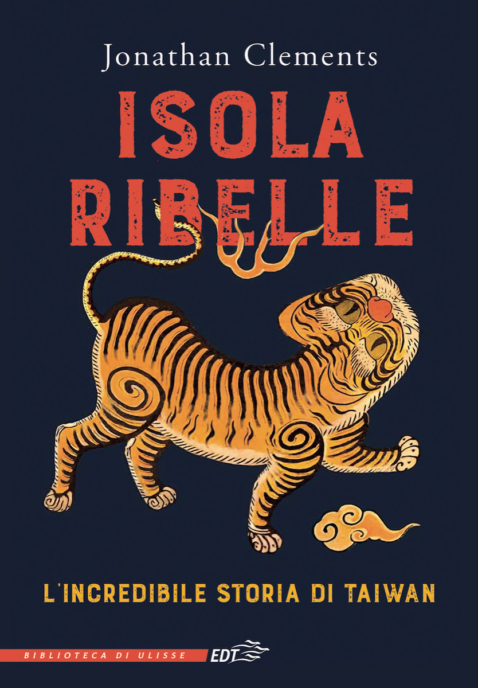
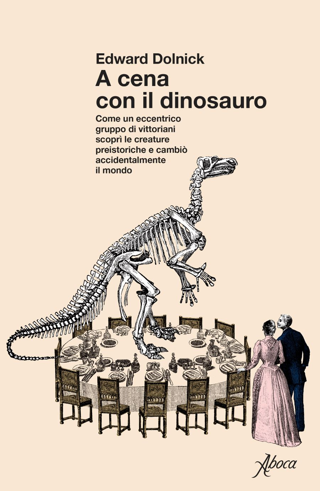

Prosegue la mia collaborazione con il progetto di blog collettivo *Assaggi* di nonfiction.it. I testi che seleziono per il progetto sono spesso articoli, racconti o estratti delle opere recensite in questo spazio, i cui autori mi hanno gentilmente concesso di tradurre e pubblicare un loro scritto inedito in Italia. Per chi volesse farsi un'idea di come traduco, *Assaggi* è il posto giusto.

<h3>Darren Byler</h3>

<a href="https://nonfiction.it/assaggi/la-storia-di-vera/">La storia di Vera</a>

Una studentessa dell'Università di Washington, originaria dello Xinjiang, invischiata nelle maglie della sorveglianza cinese.

<h3>Ravi Somaiya</h3>

<a href="https://nonfiction.it/assaggi/il-complotto-africano/">Il complotto africano</a>

Sono stati i bianchi europei, guidati da un fantomatico "mister X", a uccidere sessant'anni fa in Congo il segretario generale delle Nazioni Unite per mantenere il potere sui neri africani?

<h3>Emilio Sánchez Mediavilla</h3>

<a href="https://nonfiction.it/assaggi/beirut-non-esiste-piu/">Beirut non esiste più</a>

Una passeggiata per le strade e fra la gente di Beirut nella primavera del 2016, per assaggiare, osservare e ascoltare le molte contraddizioni di una città complessa e tormentata.

<h3>Zahra Hankir</h3>

<a href="https://nonfiction.it/assaggi/il-re-del-ful/">Il re del Ful</a>

Lo stufato di fave è il protagonista indiscusso di questo viaggio nella gastronomia, nelle tradizioni e nella storia del Libano meridionale.

<h3>Rebecca Altman</h3>

<a href="https://nonfiction.it/assaggi/sul-vinile/">Sul vinile</a>

Un saggio storico sulla produzione della plastica per capire le ragioni del disastro ferroviario di East Palestine e sensibilizzare sui rischi per la salute umana e ambientale.

<h3>Clare Hammond</h3>

<a href="https://nonfiction.it/assaggi/lungo-i-binari-delle-ferrovie-fantasma/">Lungo i binari delle ferrovie fantasma</a>

Un estratto da "On the Shadow Tracks", il viaggio-inchiesta di Clare Hammond lungo le ferrovie birmane.

---
I libri che ho tradotto
---

Ben Rawlence - Treeline - L'ultima foresta e il futuro della vita sulla terra - Francesco Brioschi Editore

Svegliamoci! - Edgar Morin - Mim Edizioni

Maria Ressa - Come resistere a un dittatore - La nave di Teseo

Petra Goedde - Culture globali - Una storia di omologazione e resistenza dal 1945 a oggi - Einaudi

Kevin Gosztola - Il caso Assange - Edizioni Piemme

Deirdre Nansen Mccloskey - Le virtu borghesi - Mondadori

Jonathan Clements - Isola ribelle - EDT

Amanda Hess - Un'altra vita - Einaudi

Edward Dolnick - A cena con il dinosauro - Aboca

Angus Lockyer - Giappone, una storia per immagini - Einaudi

